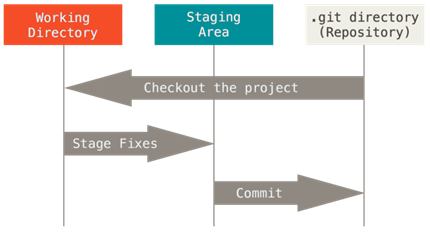
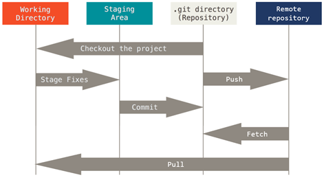
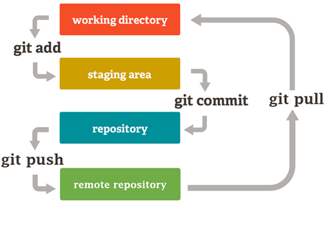
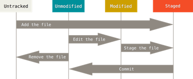

# Git - distribuirani sistem za kontrolu verzije

**Git** je trenutno najpopularniji i najrasprostranjeniji sistem za kontrolu verzije, namenjen praćenju promena izvornog koda tokom procesa razvoja softvera. Iako je razvijen sa idejom podrške koordinaciji tima programera koji zajedno radi na određenom projektu, može biti korišćen i u generalne svrhe, za praćenje promena u okviru proizvoljne kolekcije datoteka. Kako se projekat razvija i evoluira, članovi tima obavljaju testiranje, otklanjaju greške i dodaju nove delove koda znajući da bilo koja verzija koda može biti rekonstruisana u proizvoljnom trenutku. Osobe koje učestvuju u razvoju mogu na osnovu uvida u projektnu istoriju da saznaju:

- Koje su promene unete?
- Ko ih je uneo?
- Kada su promene nastale?
- Zašto su promene bile neophodne?

**Repozitorijum**, odnosno Git projekat, predstavlja kolekciju datoteka i direktorijuma u vezi sa projektom, uključujući i istoriju revizija za svaku pojedinačnu datoteku. Istorija predstavlja niz verzija iste datoteke u različitim vremenskim trenucima kada je izvršena **operacija postavljanja (eng. commit)**. Svaka novoizvršena operacija postavljanja nadovezuje se na prethodnu, tako da se u logičkom smislu dobija povezana lista koja može biti razgranata tako da prati različite grane razvoja istog projekta. Svaki učesnik koji poseduje kopiju repozitorijuma ima na raspolaganju kompletnu bazu koda koji pripada projektu, zajedno sa istorijom njegovog razvoja. Korišćenjem osnovnih alata u komandnoj liniji, ili nekog od grafičkih okruženja (GUI), korisnicima su omogućene osnovne operacije interakcije sa istorijom, kloniranja repozitorijuma, postavljanja novih verzija koda, kreiranja i spajanja grana, poređenja različitih verzija koda i sl.

Rad sa repozitorijumima olakšava organizovanje i zaštitu koda, bez čega bi rad na velikim open-source projektima bio praktično nezamisliv. Učesnici u razvoju mogu ispravljati greške ili dodavati nove funkcionalnosti bez bojazni da će time pokvariti ili poremetiti glavni tok razvoja projekta. Ovo je omogućeno primenom tematskih grana koje se mogu na jednostavan način kreirati, pripojiti glavnom toku ili proglasiti zastarelim, po potrebi. Uz pomoć mrežnih platformi kao što su GitHub ili Bitbucket, otvaraju se dodatne mogućnosti kada je u pitanju saradnja i transparentnost tokom razvoja projekta. Javni repozitorijumi omogućavaju razvojnim timovima da sarađuju i doprinose zajedničkom cilju stvaranja najboljeg mogućeg proizvoda.

## Lokalni git repozitorijum

Datoteke koje pripadaju projektu u svakom trenutku se mogu nalaziti u jednom od tri osnovna stanja:

- Postavljeno (**committed**) – podrazumeva da je datoteka bezbedno smeštena u lokalnu bazu podataka
- Izmenjeno (**modified**) – sadržaj datoteke je izmenjen od poslednjeg postavljanja, ali sadržaj još nije pohranjen u bazu
- Spremno za postavljanje (**staged**) – izmenjena datoteka je označena za postavljanje

U skladu sa tim, razlikujemo tri glavne sekcije Git projekta: Git direktorijum (**.git directory - repository**), radni direktorijum (**working directory**) i pripremna zona (**staging area**).



**Git direktorijum (repozitorijum)** je mesto gde se čuvaju metapodaci i baza podataka u vezi sa projektom. Ovo je najvažniji deo Git sistema i tu se smeštaju podaci prilikom kloniranja repozitorijuma, kao i prilikom postavljanja novih verzija.

**Radni direktorijum** sadrži datoteke koje predstavljaju stanje tekuće verzije projekta. Tekuća verzija se generiše na osnovu podataka iz baze i na raspolaganju je korisniku za unošenje izmena.

**Pripremna zona** je datoteka, koja je obično smeštena u Git direktorijumu i koja sadrži informacije o tome šta tačno treba da sadrži sledeća verzija koja će biti generisana prilikom postavljanja (commit). U Git terminologiji ova zona se naziva još i „_index_“.

Tok rada se obično odvija u tri faze koje se sukcesivno smenjuju:

1. **_Modify_**: Korisnik modifikuje sadržaj datoteka u radnom direktorijumu
2. **_Stage_**: Korisnik selektivno označava one datoteke koje trebaju biti postavljene u repozitorijum, čime se one prebacuju u pripremnu zonu (**git add**)
3. **_Commit_**: Obavlja se operacija postavljanja (commit), čime se preuzimaju datoteke iz pripremne zone i permanentno se smeštaju u Git repozitorijum (**git commit**)

## Udaljeni (_remote_) repozitorijum

U svetu softverskog razvoja, udaljeni repozitorijumi igraju ključnu ulogu u efikasnom upravljanju kodom i saradnji među timovima. Ovi repozitorijumi omogućavaju programerima da zajednički rade na projektima, dele svoj kod i prate promene. Udaljeni repozitorijumi predstavljaju verzije projekta koje se nalaze na Internetu ili negde u mreži (jedan od najčešće korišćenih servisa u ovu svrhu je github.com). Oni čuvaju sve verzije datoteka, istoriju promena i metapodatke o projektu i omogućavaju programerima da sarađuju, dele kod i sinhronizuju svoj rad.

Prednost korišćenja udaljenih repozitorijuma:

- **Saradnja**: Udaljeni repozitorijumi omogućavaju timovima da zajedno rade na istom projektu, bez obzira na fizičku lokaciju.
- **Sigurnost i Redundancija**: Čuvanje podataka na udaljenim serverima osigurava da kod ne bude izgubljen zbog kvarova na lokalnom računaru.
- **Praćenje Promena**: Udaljeni repozitorijumi omogućavaju praćenje svih promena u kodu, kao i povratak na prethodne verzije ako je potrebno.
- **Automatizacija**: Integracija sa servisima za kontinuiranu integraciju (CI/CD) olakšava automatsko testiranje i objavljivanje koda.

Ukoliko bismo proširili prethodni dijagram udaljenim repozitorijumom, on izgledao bi ovako:



Ukoliko imamo i udaljeni repozitorijum, toku rada se dodaje još jedna stavka:

1. **Push**: Postavljanje svih lokalnih promena na udaljeni repozitorijum. Prilikom ove operacije, sve promene koje se nalaze u lokalnom git direktorijumu se dodaju udaljenom repozitorijumu.

Kada radimo na nekom projektu sa većim brojem ljudi, svako može dodavati svoje lokalne promene na zajednički ualjeni repozitorijum. Povlačenje (**pull**) je operacija kojom se sve promene koje se nalaze na udaljenom repozitorijumu (ali ne i na lokalnom) preuzimaju na lokalni repozitorijum. (Operacija fetch radi veoma slično, ali za razliku od operacije pull koja vrši i preuzimanje i spajanje sa lokalnim promenama u radnom direktorijumu, fetch vrši samo preuzimanje.)

## Osnovne git komande

Git cheat sheet je dostupan na: <https://education.github.com/git-cheat-sheet-education.pdf>

**Uvek imati na umu sliku ispod! Najveći deo rada sa git-om se svodi na ove 4 komande!**


### Kreiranje repozitorijuma

```sh
git init
```

Inicijalizuje novi Git repozitorijum u tekućem direktorijumu i počinje sa njegovim praćenjem. Na ovaj način se dodaje skriveni direktorijum (.git direktorijum) u kojem je smeštena interna baza podataka neophodna za praćenje verzije.

### Kloniranje repozitorijuma

```sh
git clone <url>
```

Kreira lokalnu kopiju postojećeg repozitorijuma sa servera. Klonirani repozitorijum sadrži sve izvorne datoteke, zajedno sa istorijom promena i granama razvoja.

### Provera stanja repozitorijuma

```sh
git status
```

Svaka datoteka u radnom direktorijumu može se nalaziti u jednom od dva stanja:

- Nepraćena datoteka (**untracked**)
- Praćena datoteka (**tracked**)

Praćena je ona datoteka o čijim eventualnim promenama Git sistem vodi računa. Takva datoteka može se nalaziti u jednom od tri stanja:

- Neizmenjena (**unmodified**) – datoteka čiji sadržaj nije izmenjen od poslednjeg postavljanja
- Izmenjena (**modified**) – datoteka čiji sadržaj je promenjen
- Pripremljena za postavljanje (**staged**) – prilikom sledećeg postavljanja, biće postavljene samo one datoteke koje se nalaze u ovom stanju, tj. koje se nalaze u pripremnoj zoni (staging area)



### Dodavanje u pripremnu zonu (_staging_)

```sh
git add <path/to/file>
```

Označava izmenjene datoteke za postavljanje, čime ih prebacuje u pripremnu zonu. Ovo je prvi korak u kreiranju nove verzije koda. Sve promene koje su prebačene u pripremnu zonu će prilikom postavljanja postati integralni deo sledeće verzije, a samim tim i projektne istorije.

Često želimo dodati sve promene u _staging_ _area_. To možemo učiniti komandom:

```sh
git add –all
```

### _Commit_-ovanje promena u lokalni repozitorijum

```sh
git commit -m “<kratak opis izmena>”
```

Snima promene iz pripremne zone u repozitorijum, čime se kompletira proces kreiranja nove verzije. Novostvorena verzija predstavlja presek stanja projekta u određenom vremenskom trenutku. Sve što je prethodno prebačeno u pripremnu zonu pomoću komande **`git add`**, postaće deo nove verzije kreirane komandom **`git commit`**.

Uz komandu `git commit` se uvek dodaje i kratak opis izmena koje se vezuju za taj commit. Ove poruke treba da kratko i jasno stave do znanja šta je tačno programer dodao ili izmenio, kako bi prilikom naknadnog pregleda izmena bilo jasno šta je sve rađeno.

### Postavljanje promena na udaljeni repozitorijum

```sh
git push
```

Postavlja sve promene napravljene u lokalnom repozitorijumu (one koje su prethodno _commit_\-ovane) na udaljeni repozitorijum.

### Preuzimanje (povlačenje) promena sa udaljenog repozitorijuma

```sh
git pull
```

Preuzima promene sa udaljenog repozitorijuma i ažurira sadržaj lokalnog repozitorijuma sadržajem sa udaljenog servera.

### Povezivanje lokalnog repozitorijuma sa udaljenim 


```sh
git remote add origin <URL-do-udaljenog-repozitorijuma>
```

Ova komanda dodaje novu udaljenu lokaciju repozitorijuma sa imenom origin (najčešće se koristi ime origin), pri čemu se ovde zadaje URL do kreiranog repozitorijuma. Nakon dodavanja udaljenog repozitorijuma, neophodno je (prilikom prvog postavljanja promena) pozvati komandu:

```sh
git push -u origin main
```

Opcija `-u` obezbeđuje da svaki sledeći _push_ postavlja promene na ovaj udaljeni repozitorijum.

## Kreiranje GitHub naloga

Ukoliko prethodno nemate napravljen GitHub nalog, to možete učiniti na sledećoj stranici:

<https://github.com/signup>

Nije neophodno kreiranje novog naloga sa fakultetskim mejlom ukoliko već imate napravljen nalog. Za svaki GitHub nalog može biti vezan veći broj e-mail adresa, a onaj koji koristite prilikom kreiranja naloga će biti glavni (što se takođe može naknadno promeniti).

Napomena: Servisi za održavanje udaljenih repozitorijuma gotovo uvek imaju određeni vid kontrole pristupa repozitorijumima. Repozitorijum na GitHub-u može biti:

- Javni (Public) – svako može da vidi i klonira repozitorijum
- Privatni (Private) – samo vlasnik repozitorijuma ima pristup

## Instalacija alata Git

Alat Git se može preuzeti besplatno putem linka: <https://git-scm.com/download>

Opcije koje je poželjno (ali ne i neophodno) izabrati prilikom instalacije:

- Choosing the default editor used bz git: **Use Visual Studio Code as Git’s default editor**
- Ajdusting the name of the initial branch in new repositories: **Let Git decide**
- Adjusting your PATH environment**: Git from the command line and also from 3rd-party software**
- Choosing the SSH executable: **Use bundled OpenSSH**
- Choosing HTTPS transport backend: **Use the OpenSSL library**
- Configure the line ending conversions: **Checkout Windows-styled, commit Unix-style line endings**
- Configure the terminal editor to use with Git Bash: **Use Window’s default console window**
- Choose the default behaviour of ’git pull’: **Rebase** (detaljnije objašnjenje obe opcije je dostupno na <https://www.atlassian.com/git/tutorials/merging-vs-rebasing>)
- Choose a credential helper: **Git Credential Manager**
- Od ostalih opcija je dovoljno ostavit samo **Enable file system caching** čekirano

### Podešavanje lokalnog Git alata

Nakon instalacije Git-a, poželjno je podesiti svoj e-mail, ime i prezime. Iskoristiti e-mail koji ste upotrebili prilikom registracije na GitHub, ili bilo koji e-mail koji je povezan sa Vašim GitHub nalogom. Ovo se može obaviti putem sledećih komandi:

git config --global user.name “Ime Prezime”

git config --global user.email [email@elfak.rs](mailto:email@elfak.rs)

## Zadatak za vežbu

1. Kreirati JAVNI repozitorijum na GitHub-u pod nazivom WEB_PROBA_&lt;broj_indeksa&gt; (npr. Ako je Vaš broj indeksa 12345, naziv repozitorijuma je WEB_PROBA_12345)
2. Klonirati repozitorijum na Vaš računar
3. U okviru repozitorijuma kreirati fajl pod nazivom _index.html_ koji sadži naslov (h1 tag) sa Vašim imenom i prezimenom
4. Dodati izmene u staging zonu (git add), commit-ovati ih sa porukom “Initial commit” (git commit) I na kraju ih postaviti na udaljeni repozitorijum (git push)
5. Ponovo otvoriti fajl _index.html_ i dodati podnaslov (h2 tag) sa sadržajem “Elektronski fakultet Niš”
6. Postaviti nove izmene (add, commit, push)
7. Pregledati kako izmene izgledaju u okviru GitHub-a