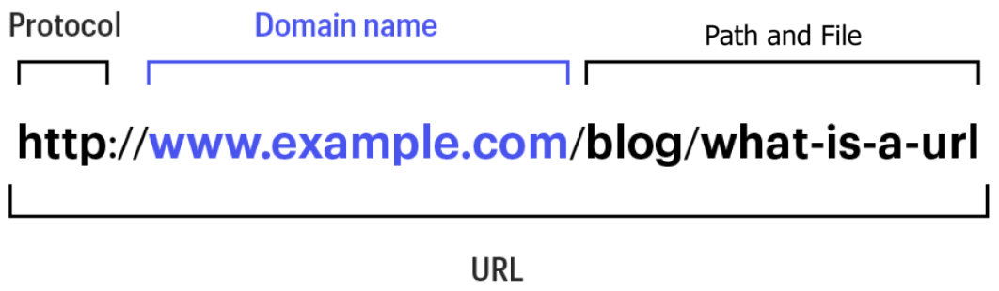

# Šta je cURL?

cURL (ime nastalo od reči Client i URL) je projekat i njegova primarna svrha i fokus jeste razvoj dva proizvoda:

-   **curl**, alat komandne linije
-   **libcurl** C biblioteku

I alat i biblioteka vrše Internet prenost resursa koji se navode preko URL adresa koristeći Internet protokole. Curl se bavi svim stvarima koje su vezane za prenos putem internet protokola.

Takođe je važno napomenuti da cURL i libcurl pokušavaju da izbegnu rukovanje stvarnim podacima koji se prenose. Na primer, nemaju znanje o HTML-u ili bilo čemu drugom što je popularno za prenos putem HTTP-a, ali znaju kako da prenesu takve podatke putem HTTP-a.

Oba proizvoda se često koriste ne samo za pokretanje hiljada ili miliona skripti i aplikacija za svet povezan internetom, već se takođe široko koriste za testiranje servera, eksperimentisanje sa protokolima i isprobavanje novih stvari. Biblioteka se koristi u svakoj zamislivoj vrsti ugrađenog uređaja gde su potrebni internet prenosi: zabava u automobilima, televizori, Blu-Ray plejeri, set-top box uređaji, štampači, ruteri, igrački sistemi itd.

# Mreže i protokoli – podsetnik

Internet predstavlja ogroman broj međusobno povezanih računara (u opštem slučaju uređaja). Komunikacija preko interneta se obavlja putem IP (Internet Protocol), pri čemu svaki računar ima jedinstvenu IP adresu. U terminologiji mreža, svaki od ovih računara se naziva **host**.

## Klijent-server model


Računar, tablet ili telefon ispred kojeg sedite obično se naziva **klijent**, dok se mašina na udaljenoj lokaciji, sa kojom želite da razmenjujete podatke, naziva **server**. Glavna razlika između klijenta i servera je u ulogama koje igraju. Inicijativu za prenos podataka uvek preuzima klijent, jer server ne može da kontaktira klijenta, ali klijent može da kontaktira server.

## DNS

Kada mi kao klijent želimo da pokrenemo prenos sa serverom, obično ne znamo njegovu IP adresu, već znamo njegovo ime. Možemo koristiti **URL** kao što je <http://example.com/index.html>, što znači da se klijent povezuje i komunicira sa hostom imenom example.com. Pretvaranje imena u IP adresu naziva se _hostname resolving_. Ime se prevodi u jednu ili više adresa. Ovo se obično obavlja putem **DNS** **(Domain Name System)** servera, pri čemu se DNS može zamisliti kao velika tabela za pretragu koja može da konvertuje imena u adrese za sva imena na internetu.

## TCP

Veza koja se ostvaruje između klijenta i servera, nakon što klijent kontaktira server se naziva **TCP (Transmission Control Protocol)** veza. Putem ove veze, komunikacija se može obavljati obostrano. Prilikom povezivanja, klijent selektuje na koji **broj porta (port number)** servera će se povezati. Ako napravimo analogiju u kojoj bi TCP bio poštar koji prenosi pisma, ovde bi server bio zgrada (pri čemu bi IP adresa bila adresa ove zgrade), a proj porta bi bio broj stana, odnosno sanduče u koje poštar ostavlja pismo.

Protokoli aplikativnog nivoa (iznad TCP) koje curl podržava su: DICT, FILE, FTP, FTPS, GOPHER, GOPHERS, HTTP, HTTPS, IMAP, IMAPS, LDAP, LDAPS, MQTT, POP3, POP3S, RTMP, RTSP, SCP, SFTP, SMB, SMBS, SMTP, SMTPS, TELNET, TFTP, WS, WSS; od kojih je za nas najznačajniji HTTP(S).

# HTTP osnove

**HTTP (engl. _Hyper Text Transfer Protocol_)** je glavni i najvažniji protokol kada je u pitanju prenos informacija na Webu. Osnovna namena ovog protokola je prenos HTML dokumenata tj. web stranica, ali se koristi i za druge namene, kao što je kompunikacija sa web servisima (REST API).

## HTTP zahtev i odgovor

HTTP zahtev uvek inicira klijent. Zahtev (HTTP Request) se sastoji od:

-   **Request Line** – definiše HTTP metodu koja se koristi, putanju do resursa koji zahtevamo i verziju HTTP. Na primer:
    ```http
    GET /software/htp/cics/index.html HTTP/1.1
    ```
-   **HTTP headers (zaglavlja)** – sadrže informacije o klijentskom zahtevu koje server može da iskoristi da odluči kako da odgovori klijentu. Na primer:
    ```http
    Accept-Language: fr, de
    If-Modified-Since: Fri, 10 Dec 2004 11:22:13 GMT
    ```
-   **Message (Request) body (telo)** – predstavlja sam sadržaj poruke koje želimo da pošaljemo serveru. Ovo polje nije obavezno.

Neke od najčešćih HTTP metoda su:

-   **GET** – zahteva reprezentaciju nekog resursa (vraća podatke)
-   **POST** – dodaje neki podatak na server (postavlja podatke i menja stanje na serveru)
-   **PUT** – menja podatak na serveru
-   **DELETE** – briše podatak na serveru

Primer HTTP zahetva:

-   **GET zahtev**:
    ```http
    GET / HTTP/1.1
    User-agent: curl/2000
    Host: example.com
    ```
-   **POST zahtev**:

    ```http
    POST / HTTP/1.1
    Host: example.com
    User-agent: curl/2000
    Content-Length: 5

    hello
    ```

Primer HTTP odgovora:

```http
HTTP/1.1 200 OK
Server: example-server/1.1
Content-Length: 5
Content-Type: plain/text

hello
```
## Status kod

_HTTP status_ kod je trocifren broj koji server vraća kao odgovor na zahtev klijenta (npr. pregledača), i koristi se za označavanje uspešnosti ili neuspešnosti tog zahteva. Ovi kodovi su podeljeni u kategorije prema prvoj cifri: 
- `1xx` označava informativne poruke, 
- `2xx` uspešne zahteve, 
- `3xx` redirekcije, 
- `4xx` greške na strani klijenta, a 
- `5xx` greške na strani servera. 

Na primer, kod `200` znači da je zahtev uspešno obrađen, dok `404` označava da tražena stranica nije pronađena.

## Struktura URL


Ako posmatramo neki URL, koji klijent koristi za kontaktiranje servera, npr:

<https://www.example.com/path/to/file>

-   **https** – označava protokol (u ovom slučaju je to HTTPS)
-   **www.example.com** – _hostname_ čiju je IP adresu neophodno pronaći. Ovo ime se često stavlja u Host: zaglavlje
-   **/path/to/file** – resurs koji klijent zahteva od servera

# `curl` alat komandne linije

`curl` alat se koristi na sledeći način (pribavljanje resursa koji se nalazi na http://example.com):
```sh
curl http://example.com
```
Ova naredba se prevodi u sledeći HTTP zahtev:

```http
GET / HTTP/1.1
Host: example.com
User-Agent: curl/8.4.0
Accept: */*
```

Odgovor na ovaj zahtev je sledeći:

```http
HTTP/1.1 200 OK
Age: 533505
Cache-Control: max-age=604800
Content-Type: text/html; charset=UTF-8
Date: Thu, 22 Feb 2024 13:08:20 GMT
Etag: "3147526947+ident"
Expires: Thu, 29 Feb 2024 13:08:20 GMT
Last-Modified: Thu, 17 Oct 2019 07:18:26 GMT
Server: ECS (bsb/279B)
Vary: Accept-Encoding
X-Cache: HIT
Content-Length: 1256

<!doctype html>
<html>
<head> ...
```

Da bismo pregledali zaglavlja zahteva i odgovora, dodajemo opciju –verbose ili skraćeno -v:

```sh
curl http://example.com -v
```

Ukoliko želimo da pošaljemo podatke na server, dodajemo opciju -d &lt;podaci&gt;. Ukoliko naši podaci sadrže razmake, stavljamo ih izmedju navodnika. Na primer:
```sh
curl http://example.com -d „Hello World“
```
Metodu koju želimo da koristimo možemo navesti nakon opcije -X:
```sh
curl http://example.com -d „Hello World“ -X PUT
```
Ukoliko ne navedemo eksplicitno koju metodu želimo da koristimo, curl podrazumeva GET metodu ako ne navedemo podatke, odnosno POST metodu ako navedemo podatke.

Opcije curl naredbe se mogu zadavati u proizvoljnom redosledu i pre i posle URL-a.

## Primeri
```sh
curl https://jsonplaceholder.typicode.com/posts
curl https://jsonplaceholder.typicode.com/posts -X GET
curl https://jsonplaceholder.typicode.com/posts -d "Hello world"
curl https://jsonplaceholder.typicode.com/posts -d "Hello world" -X POST -v
```
